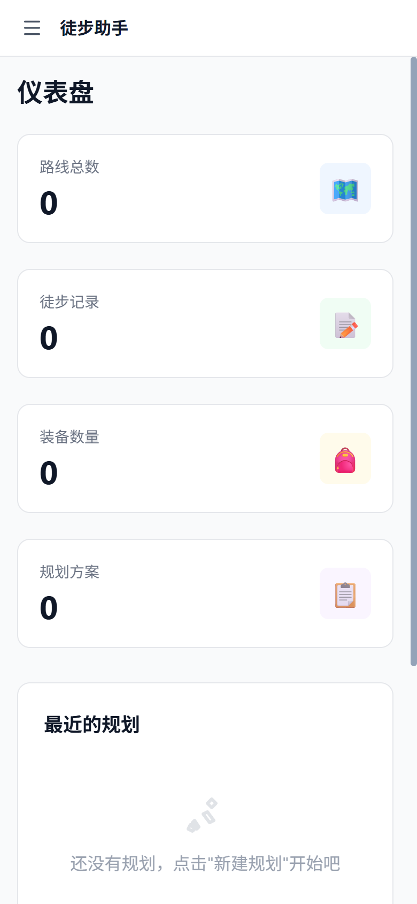
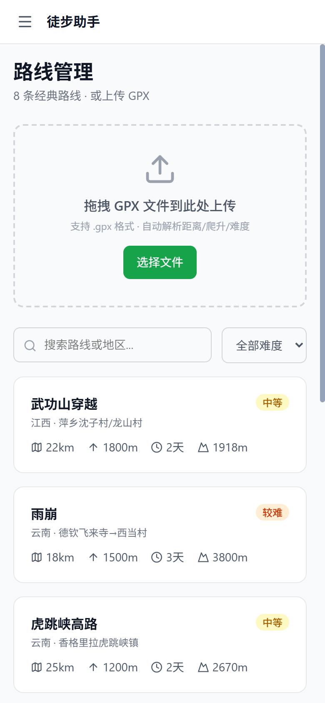
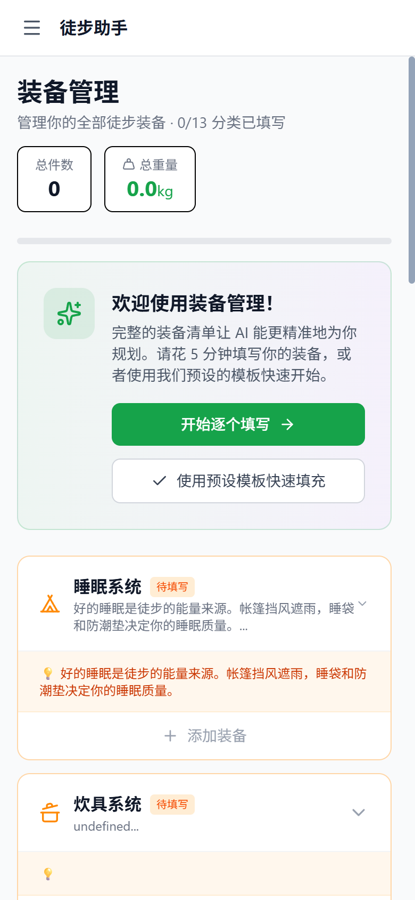
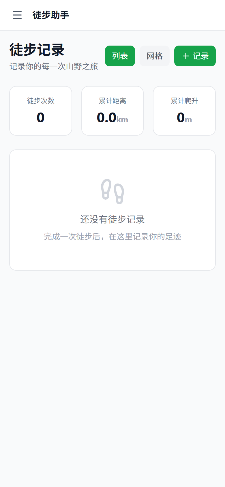
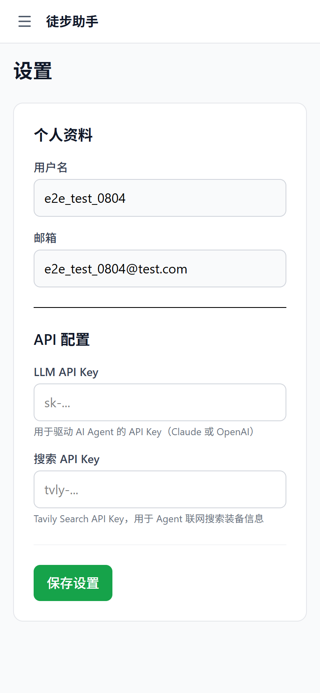

# 徒步助手 · Hiking Assistant

> 输入一句徒步想法，6 个 AI Agent 分工协作，几分钟生成完整方案：**路线 / 装备 / 天气 / 路餐 / 安全 / 日程**。

一个把 LLM 真正落地成产品的全栈项目——不是 AI 玩具，而是从「用户说一句话」到「生成 6 大板块完整徒步方案」的**真实可用应用**。

---

## 它能做什么

用户输入：

> 十一想去武功山徒步，两天一夜，新手，有基础装备

系统自动派出 Agent 团队分工：

| 你得到的方案 | 哪个 Agent 在干活 |
|---|---|
| 路线分析 + 分日行程（起终点/地形/水源/亮点/风险/节奏） | **RouteAnalyst** |
| 实时天气预报 + 徒步建议 | **WeatherService** |
| 按路线 + 个人情况定制的装备清单 | **EquipmentPlanner** |
| 装备方案合理性审核（自动纠错） | **EquipmentReviewer** |
| 安全风险评估（天气/地形/装备） | **SafetyAssessor** |
| 每日三餐路餐（品牌 + 价格 + 预算分层） | **MealPlanner** |
| 汇总所有 Agent 输出为最终方案 | **Synthesizer** |

规划过程中，前端实时展示每个 Agent 的思考日志——不是黑盒，整个过程看得见。

---

## 核心亮点

- **多 Agent 协作架构**：6 个 Agent + 2 个服务，FastAPI 异步工作流编排（`asyncio.create_task` 后台任务），前端轮询实时看进度
- **三级递进检索**：知识库(秒级) → LLM 模型知识(~15s) → DuckDuckGo 联网搜索(~20s) + LLM 结构化提取，**未知路线自动兜底**，覆盖 136 条热门路线
- **136 条路线知识库**：每条含分日分段（起终点 / 地形 / 水源 / 亮点 / 风险 / 节奏）
- **AI 落地细节**：LLM 提取用户装备画像，6 种场景自动调整；联网搜索结果由 LLM 提取为结构化数据
- **真实数据接入**：Open-Meteo 天气（免 Key）、DuckDuckGo 搜索、DeepSeek LLM（Anthropic 备选）
- **工程化前端**：React + TS + PWA（离线可用，SW 缓存自动版本号）、移动端 390px 无横向溢出、Leaflet 轨迹地图、GPX 上传自动解析
- **完整功能闭环**：聊天式交互、装备管理(13 分类)、路线库、徒步记录 + 照片/视频上传展示

---

## 架构

```
用户输入 → POST /api/plans → asyncio.create_task(后台工作流)
                                    │
    Phase 1   RouteAnalyst(知识库→LLM→联网搜索) → WeatherService → EquipmentPlanner
    Phase 2   EquipmentReviewer + SafetyAssessor（规则引擎，审核纠错）
    Phase 2.5 MealPlanner（知识库 + 规则）
    Phase 3   Synthesizer（汇总 → 最终方案）
                                    │
    前端轮询 GET /api/plans/{id} → 实时展示各 Agent 日志 + 完整方案
```

---

## 技术栈

| 层 | 技术 |
|---|---|
| 前端 | React 19 + TypeScript + Vite + Tailwind CSS v4 + Leaflet / react-leaflet + Zustand + Recharts + PWA |
| 后端 | Python 3.12 + FastAPI + SQLAlchemy 2.0 (async) + SQLite (aiosqlite) |
| AI | DeepSeek (`deepseek-chat`, OpenAI 兼容) + Anthropic Claude 备选，多 provider 切换 |
| 搜索 | DuckDuckGo（免费，`ddgs`） |
| 天气 | Open-Meteo（免费，无需 API Key） |

---

## 快速开始

### 1. 后端（端口 8001）

```bash
cd backend
python -m venv .venv && .venv\Scripts\activate   # Windows
pip install -r requirements.txt
cp .env.example .env                             # 填入 DEEPSEEK_API_KEY
uvicorn app.main:app --host 127.0.0.1 --port 8001
```

### 2. 前端（端口 5173）

```bash
cd frontend
npm install
npm run dev
```

浏览器打开 http://localhost:5173

---

## 项目结构

```
├── backend/
│   ├── app/
│   │   ├── agents/          # 6 个 Agent（RouteAnalyst / EquipmentPlanner / ... ）
│   │   ├── workflows/       # 工作流编排（plan_workflow.py）
│   │   ├── services/        # 天气 / 路餐 / 搜索 / LLM / 坐标服务
│   │   ├── api/             # FastAPI 路由（plans / routes / equipment / trips / chat）
│   │   └── main.py
│   └── data/                # 路线知识库 JSON（136 条，含分日分段）
├── frontend/                # React SPA（Vite + TS + Tailwind + PWA）
├── data/                    # SQLite 数据库 + 用户媒体文件（Git 忽略）
└── docker-compose.yml       # （开发遗留：Postgres/Redis 目前未使用，默认 SQLite）
```

> 说明：路线知识库存于 `backend/data/*.json`，运行时加载，无需数据库迁移；`docker-compose.yml` 中的 Postgres/Redis 是早期设计，当前默认使用 SQLite。

---

## 界面预览

| 首页看板 | 聊天式规划入口 |
|---|---|
|  |  |

| 路线库 | 装备管理 | 徒步记录 | 设置 |
|---|---|---|---|
|  |  |  |  |

> 完整演示：输入"武功山徒步两天一夜新手"，即可看到 6 个 Agent 逐个生成方案的过程。

---

## 开发日志

完整开发过程记录在项目记忆文件（8 天迭代：架构 → 6 Agent → 速度优化 16s → 50+ 路线库 → 136 条分段 → 移动端 → PWA → 媒体上传）。
